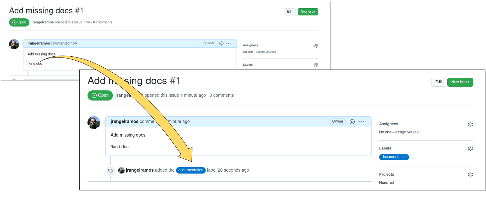
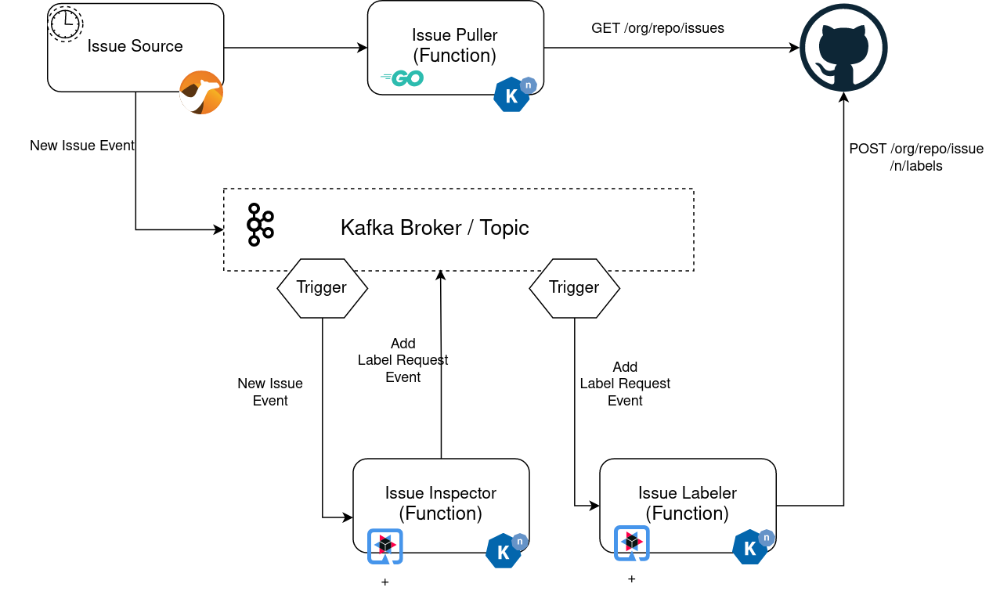
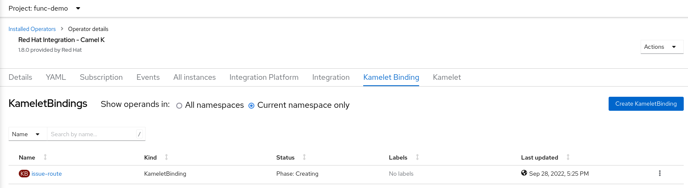
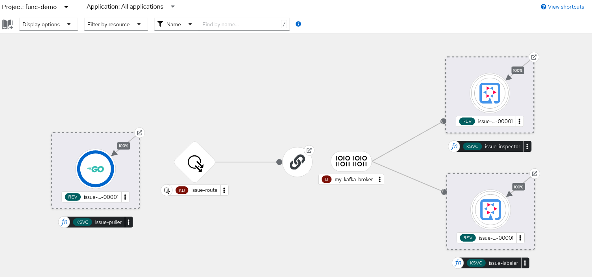
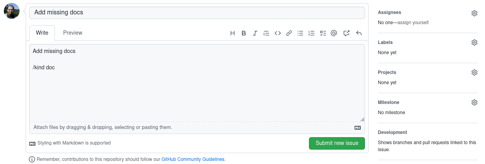
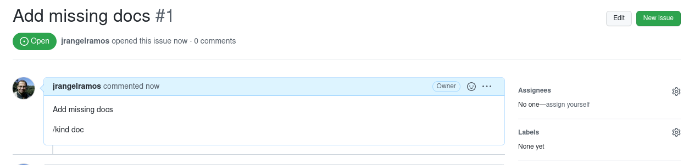
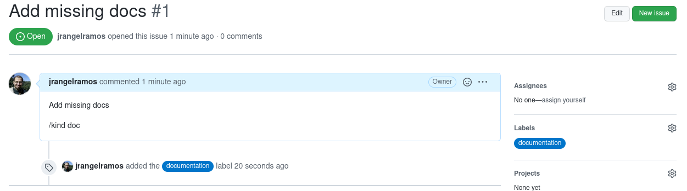

# Func Demo - Creating a GitHub bot using Camel-K, Knative Functions and Cloud Events

Let’s put all together we learned about **functions** with `kn func` and its capabilities. In this demo we will create a bot that will automate the creation of labels on new or modified issues for a pre-defined repository, based on the issue description. 

In this demo we will explore the following func and Knative Serving and Eventing features

- Quarkus functions that responds to CloudEvents using s2i builder
- Go function using Http template and community pack builder
- Use of env vars, secrets and labels
- Camel-K / Kamelet as Event Source
- Kafka Broker and Triggers
- On Cluster builds with Openshift Pipelines
- Event Driven approach

## Overview

This application demonstrates how to build a Knative Event Driven application using **Camel-K**, **Kafka** 
and **Knative Functions** to automate the creation of labels for New Issues of a given GitHub Repository

So every time you create an Issue with some specific pre-defined *GitOps command* (in this case "/kind"), the 
application will add (as needed) the corresponding label




Overral architecture can be represented as below:



<!---
A **live** demo for this one is running and interacting with a test
[repository](https://github.com/jrangelramos/node-fn). Feel free to try it by creating
a new issue [here](https://github.com/jrangelramos/node-fn/issues/new).  In the comment field
ensure to include "/kind *TYPE*" which *TYPE* can be one of the following: *feature*, *enhancement*,
*bug* or *doc*.
-->

### Services

- **issue-source**  (camel integration)
- **issue-puller** (Go function)
- **issue-inspector**  (Quarkus function) 
- **issue-labeler**  (Quarkus function )

### CloudEvents

Let's define the following **CloudEvents type** for our services
- **NewOrModifiedIssue** : Generated when a new or modified GitHub issue is identified
- **AddLabelRequest** : Generated when a new label is required to be added to an issue

## Preparation 

Our application will automate the creation of labels on **issues** for a GitHub repository of your choice that you have WRITE access.

Create a new empty GitHub repository or use any personal repository you already have (preferable one that has no issues)

In my case I will use this very one, but could be any other:
```
https://github.com/jrangelramos/func-kamel-demo

# GITHUB_ORG is 'jrangelramos' and GITHUB_REPO is 'func-kamel-demo'
```

For this demo is required you have a GitHub account and [Personal Access Token](http://github.com/settings/tokens) 
that will be used by the functions to read issues and write labels. In case you don't have any, please create one. 

## Running on Openshift Cluster

For Openshift the following operators are required for this demo:
* Openshift Serverless Operator
* Openshift AMQ Streams
* Openshift Camel-K

It is required you have:
 * Kafta Cluster installed
 * Knative Serving, Knative Eventing and Knative Kafka already created on the cluster

It is also desired you have `oc` and `kn` CLI on your PATH. It's recommended,
but not required, to have `kamel` CLI as well

## Implementation

### Create Project 

```sh
mkdir func-kamel-demo
cd func-kamel-demo
```

### Setup Secrets and Config Maps

Our first function will be responsible to query the GitHub API to retrieve issues. 
GitHub has a rate limit of 60 api calls per hour. To increase that number we need to 
perform the call authenticated. 

To check your current rate limit you can run:
```sh
curl -H "Authorization: Bearer YOUR_TOKEN" https://api.github.com/users/YOUR_GITHUB_ORG -I
...
x-ratelimit-limit: 5000
x-ratelimit-remaining: 4997
...
```

So let's first create a **secret** to store your GitHub Personal Access Token. 

```sh
oc create secret generic gh-token --from-literal=token=YOUR_GITHUB_TOKEN
```

Create config maps to store the GitHub Repository used by our test.
```
oc create cm gh-config \
  --from-literal=org=YOUR_GITHUB_ORG \
  --from-literal=repo=YOUR_GITHUB_REPO
```


### Create `issue-puller` Function

Let's create our first function responsible to query GitHub API. For this example let's
use Go as language and HTTP as our template 

```
$ kn func create --language go --template http issue-puller
Created go function in /home/jeramos/projects/functions/func-kamel-demo/issue-puller

$ cd issue-puller ; ls
func.yaml  go.mod  handle.go  handle_test.go  README.md
```

The function will access our test repo info using environment variables, so let's add them.
From the function directory run:

```shell
$ kn func config envs add --name=GITHUB_ORG --value='{{ configMap:gh-config:org }}'
$ kn func config envs add --name=GITHUB_REPO --value='{{ configMap:gh-config:repo }}'
$ kn func config envs add --name=GITHUB_TOKEN --value='{{ secret:gh-token:token }}'
```


NOTE: `kn func` also gives you an interactive way to add environment variables bindings. Just as an example, the above variable GITHUB_REPO could be added as following:
```
$ kn func config envs add
? What type of Environment variable do you want to add? ConfigMap: value from a key
? Which ConfigMap do you want to use? gh-config
? Please specify the Environment variable name: GITHUB_REPO
? Please specify a key from the selected ConfigMap: repo
Environment variable entry was added to the function configuration

```

Implement the function to call GitHub API. Replace the content of `handle.go` by the following

```go
package function

import (
	"context"
	"fmt"
	"io/ioutil"
	"net/http"
	"os"
	"strings"
)

func Handle(ctx context.Context, res http.ResponseWriter, req *http.Request) {
	org := os.Getenv("GITHUB_ORG")
	repo := os.Getenv("GITHUB_REPO")
	token := os.Getenv("GITHUB_TOKEN")

	body, err := QueryIssues(org, repo, token)
	if err == nil {
		res.Write(body)
	} else {
		fmt.Println(err)
	}
}

func QueryIssues(org string, repo string, token string) (body []byte, err error) {
	url :=  fmt.Sprintf("https://api.github.com/repos/%s/%s/issues", org, repo)
	req, err := http.NewRequest("GET", url, strings.NewReader(""))
	if err != nil {
		return nil, err
	}
	req.Header.Add("Content-Type", "application/vnd.github.v3+json")
	req.Header.Add("Authorization", "Bearer " + token)
	client := &http.Client{}
	resp, err := client.Do(req)
	if err != nil {
		return nil, err
	}
	defer resp.Body.Close()
	return ioutil.ReadAll(resp.Body)
}

```

For simplicity delete the file `handle_test.go` and then deploy the function

```
$ kn func deploy --builder=pack
   🙌 Function image built: image-registry.openshift-image-registry.svc:5000/func-demo/issue-puller:latest
   ✅ Function created in namespace "func-demo" and exposed at URL: 
   https://issue-puller-func-demo.apps.myserver.dev.net
```

#### Test it works

Let's test our function is up and running and functions. Invoke the function endpoint with curl or
using invoke command as below:
```
$ kn func invoke
[]
```
It should return the issues of your selected repository (in case any) or an empty result just as above.

Great!! Our first function is ready. Let's now create our second Knative Function

### Create `issue-inspector` Function

This Function will be responsible to inspect the issue description and identify the corresponding label.

The Function receives as input a CloudEvent with a GitHub Issue as data and returns  "AddLabelRequest" 
CloudEvent in case the label is not present the Issue.

Let's create the function from scratch using a **Quarkus** CloudEvents template.

```
$ kn func create -l quarkus -t cloudevents issue-inspector
Created quarkus function in /home/jeramos/projects/functions/func-kamel-demo/issue-inspector

$ cd issue-inspector
```

Under `src/main/java/functions` create the file `GitHub.java` to hold the model for the 
data received on the input CloudEvent

```java
package functions;

import com.fasterxml.jackson.databind.PropertyNamingStrategies;
import com.fasterxml.jackson.databind.annotation.JsonNaming;

import java.util.List;

public class GitHub {

    @JsonNaming(PropertyNamingStrategies.SnakeCaseStrategy.class)
    public static class Issue {

        public String repositoryUrl;
        public int number;
        public String title;
        public String body;
        public List<Label> labels;
        public URLRef pullRequest;

        public boolean isPR() {
            return pullRequest != null && pullRequest.url != null;
        }
        public boolean existsLabel(String label) {
            return labels != null && labels.stream().anyMatch( l -> label.equals(l.name) ); 
        }

        @Override
        public String toString() {
            return "Issue{" +
                    "repositoryUrl='" + repositoryUrl + '\'' +
                    ", number=" + number +
                    ", title='" + title + '\'' +
                    ", body='" + body + '\'' +
                    ", labels=" + labels +
                    '}';
        }
    }

    public static class Label {
        public String name;
    }
    public static class URLRef {
        public String url;
    }
}

```

Now let's implement the model used as output for our function.

Under `src/main/java/functions` create the file `AddLabelRequest.java`

```java
package functions;

import com.fasterxml.jackson.annotation.JsonInclude;

@JsonInclude(JsonInclude.Include.NON_NULL)
public class AddLabelRequest {

    public String url;
    public Integer number;
    public String label;

    public AddLabelRequest() {}

    public AddLabelRequest(String url, Integer number, String label) {
        this.url = url;
        this.number = number;
        this.label = label;
    }
    @Override
    public String toString() {
        return "AddLabelRequest{" +
                "url='" + url + '\'' +
                ", number=" + number +
                ", labelToAdd='" + label + '\'' +
                '}';
    }
}
```

Now let's implement the actual function logic. Replace the content of the file
`src/main/java/functions/Function.java` by:

```java
package functions;

import io.quarkus.funqy.Funq;
import io.quarkus.funqy.knative.events.CloudEvent;
import io.quarkus.funqy.knative.events.CloudEventBuilder;
import io.quarkus.logging.Log;

import java.util.Map;
import java.util.UUID;
import java.util.regex.Matcher;
import java.util.regex.Pattern;

public class Function {

    static String LABEL_REQUEST_EVENT_TYPE = "AddLabelRequest";

    @Funq
    public CloudEvent<AddLabelRequest> function(CloudEvent<GitHub.Issue> cloudEvent) {

        GitHub.Issue issue = cloudEvent.data();
        Log.infof("INCOMING EVENT %s %s", cloudEvent.type(), issue);

        if (!issue.isPR() && issue.body != null) {
            String kind = parseKind(issue.body);
            if (kind != null) {
                String labelToAdd = kindLabelMap.get(kind);

                // Returns a AddLabelRequest event in case the label does not exists
                if (labelToAdd != null && !issue.existsLabel(labelToAdd)) {
                    AddLabelRequest requestEvent = new AddLabelRequest(issue.repositoryUrl, issue.number, labelToAdd);

                    Log.infof("OUTGOING EVENT %s %s", LABEL_REQUEST_EVENT_TYPE, requestEvent);
                    return CloudEventBuilder.create()
                            .source("issue-inspector")
                            .type(LABEL_REQUEST_EVENT_TYPE)
                            .id(UUID.randomUUID().toString())
                            .build(requestEvent);
                }
            }
        }
        // Returns an empty event in case label is already in the issue
        return CloudEventBuilder.create().id(UUID.randomUUID().toString()).build(new AddLabelRequest());
    }

    private String parseKind(String body) {
        Pattern pattern = Pattern.compile("(/kind[ ]+)([a-zA-Z]+)", Pattern.CASE_INSENSITIVE);
        Matcher matcher = pattern.matcher(body);
        return matcher.find() ? matcher.group(2) : null;
    }

    static Map<String, String> kindLabelMap = Map.of(
            "enhancement", "enhancement",
            "feature", "enhancement",
            "bug", "bug",
            "doc", "documentation"
    );

}
```

Remove `src/test` folder as well as the files `Input.java` and `Output.java`.

Deploy the function
```
$ kn func deploy
```
The above command may take some time since it needs to pull all Maven dependencies.

Tip: With `--verbose` you can follow up the build process.

#### Test the deployed function

Send a cloud event simulating a new issue created with '/kind doc'

```shell
curl -X POST \
   -H "ce-id: message-1" \
   -H "ce-specification: 1.0" \
   -H "ce-type: AddOrModifiedIssue" \
   -H "content-type: application/json" \
   -d '{"repository_url": "any","number": 1,"title": "any", "body": "issue /kind doc", "labels": []}' \
   $(kn func info -o url)
```

We should see as response
```
{"url":"any","number":1,"label":"documentation"}
```

Alright! Let's move on to our third and last Knative Function for this demo.

### Create `issue-labeler` Function

This function will be responsible to add a Label to an issue on a GitHub repository. 
It receives as input a CloudEvent of type **AddLabelRequest**.

Well will create the function from scratch also using a **Quarkus** CloudEvents template.

```
$ kn func create -l quarkus -t cloudevents issue-labeler
Created quarkus function in /home/jeramos/projects/functions/func-kamel-demo/issue-labeler

$ cd issue-labeler
```

In GitHub API to add labels requires and authenticated request. So ask `func` to bind your GitHub Token
(already on the secret) as an environment variable to be visible on the running function.

```
$ kn func config envs add --name=GITHUB_TOKEN --value='{{ secret:gh-token:token }}'
```

Edit the file `src/main/java/functions/Input.java`, by adding to attributes to hold the AddLabelRequest CloudEvent data fields.

```java
package functions;

import com.fasterxml.jackson.databind.PropertyNamingStrategies;
import com.fasterxml.jackson.databind.annotation.JsonNaming;

public class Input {

    public String url;
    public int number;
    public String label;

}
```

Implement the actual function, by setting the content of `src/main/java/functions/Function.java` to:

```java
package functions;

import io.quarkus.funqy.Funq;
import io.quarkus.funqy.knative.events.CloudEvent;
import io.quarkus.funqy.knative.events.CloudEventBuilder;
import io.quarkus.logging.Log;
import org.eclipse.microprofile.config.inject.ConfigProperty;

import java.net.URI;
import java.net.http.HttpClient;
import java.net.http.HttpRequest;
import java.net.http.HttpResponse;

public class Function {

    static String LABEL_ADDED_SUCCESS_EVENT = "IssueLabelAddedSuccess";
    static String LABEL_ADDED_FAILURE_EVENT = "IssueLabelAddedFailure";

    final HttpClient httpClient = HttpClient.newHttpClient();

    @ConfigProperty(name="GITHUB_TOKEN")
    String ghAuthToken;

    @Funq
    public CloudEvent<Output> function(CloudEvent<Input> input) {

        Input addLabelRequest = input.data();
        boolean success = false;
        try {

            String url = String.format("%s/issues/%s/labels",
                    addLabelRequest.url,
                    addLabelRequest.number);

            // Prepare the data to be sent on Post to GitHub API
            String data = String.format("{\"labels\": [\"%s\"]}",
                    addLabelRequest.label);

            HttpRequest request = HttpRequest.newBuilder()
                    .uri(URI.create(url))
                    .POST(HttpRequest.BodyPublishers.ofString(data))
                    .setHeader("Accept", "application/vnd.github+json")
                    .setHeader("Authorization", "Bearer " + ghAuthToken)
                    .build();

            success = httpClient.send(request, HttpResponse.BodyHandlers.ofString()).statusCode() == 200;

        } catch (Exception e) {
            Log.error(e);
        }
        Log.infof("Inclusion of label %s to the Issue #%s of repository %s was %s",
                addLabelRequest.label,
                addLabelRequest.number,
                addLabelRequest.url,
                success ? "SUCCESS" : "FAILURE") ;

        return CloudEventBuilder.create()
                .type(success ? LABEL_ADDED_SUCCESS_EVENT : LABEL_ADDED_FAILURE_EVENT)
                .source("issue-labeler")
                .build(new Output("process completed"));
    }

}
```

Note that Quarkus injects the envrionment variable GITHUB_TOKEN (that will have your GitHub token) 
on the annotated variable, so we can use it on the function implementation

```java
    @ConfigProperty(name="GITHUB_TOKEN")
    String ghAuthToken;
```

At the end, it returns 2 different Cloud Event types events to represent success and failures,
that could be consumed by a different function. For simplicity of this demo we will 
just ignore them.

Remove `src/test` folder and deploy the function

```
$ kn func deploy
```

This was our last functions deployment. Check they are all ready to serve.
```shell
$ kn func list
NAME             NAMESPACE  RUNTIME  URL                                                      READY
issue-inspector  func-demo  quarkus  https://issue-inspector-func-demo.apps.myserver.dev.net  True
issue-labeler    func-demo  quarkus  https://issue-labeler-func-demo.apps.myserver.dev.net    True
issue-puller     func-demo  go       https://issue-puller-func-demo.apps.myserver.dev.net     True

```

### Create Eventing resources: Kafka Broker and Triggers

At this point we all Functions we need, so prepare the Eventing resources. 

```shell
$ mkdir eventing ; cd eventing
```

Let's start creating the Kafka Broker names as `my-kafka-broker`

Create the file `kafka-broker.yaml` with the following content:
```yaml
apiVersion: eventing.knative.dev/v1
kind: Broker
metadata:
  annotations:
    eventing.knative.dev/broker.class: Kafka
  name: my-kafka-broker
spec:
  config:
    apiVersion: v1
    kind: ConfigMap
    name: kafka-broker-config
    namespace: knative-eventing
```

Create the trigger that will filter **NewOrModifiedIssue** events and send them 
to the **issue-inspector** service. Create the file `trigger-newissue.yaml` with the below:

```yaml
apiVersion: eventing.knative.dev/v1
kind: Trigger
metadata:
  name: trigger-newissue
spec:
  broker: my-kafka-broker
  filter:
    attributes:
      type: NewOrModifiedIssue
  subscriber:
    ref:
      apiVersion: serving.knative.dev/v1
      kind: Service
      name: issue-inspector
```

Create the trigger that will filter **AddLabelRequest** events and send them 
to the **issue-labeler** service. Create the file `trigger-addlabel.yaml` with the below:

```yaml
apiVersion: eventing.knative.dev/v1
kind: Trigger
metadata:
  name: trigger-addlabel
spec:
  broker: my-kafka-broker
  filter:
    attributes:
      type: AddLabelRequest
  subscriber:
    ref:
      apiVersion: serving.knative.dev/v1
      kind: Service
      name: issue-labeler
```

Apply them to the cluster

```shell
$ oc apply -f kafka-broker.yaml
broker.eventing.knative.dev/my-kafka-broker created

$ oc apply -f trigger-newissue.yaml
trigger.eventing.knative.dev/trigger-newissue created

$ oc apply -f trigger-addlabel.yaml
trigger.eventing.knative.dev/trigger-addlabel created
```

Inspect the created resources and take note of the broker URL (we will need it later)

```shell
$ oc get broker,trigger
NAME                                          URL                                                                                        AGE     READY   REASON
broker.eventing.knative.dev/my-kafka-broker   http://kafka-broker-ingress.knative-eventing.svc.cluster.local/func-demo/my-kafka-broker   3m43s   True    

NAME                                            BROKER            SUBSCRIBER_URI                                       AGE   READY   REASON
trigger.eventing.knative.dev/trigger-addlabel   my-kafka-broker   http://issue-labeler.func-demo.svc.cluster.local     58s   True    
trigger.eventing.knative.dev/trigger-newissue   my-kafka-broker   http://issue-inspector.func-demo.svc.cluster.local   66s   True  
```


### Create `issue-source` service

Finally the last resources that needs to be created. Let's implement our `issue-source` integration,
which will be responsible to initiate the **NewOrModified** CloudEvents whenever a new issue
is created and modified, and send them to our **Broker** so the even get processed by our Functions
`issue-inspector` and `issue-labeler`.


```
$ mkdir issue-source ; cd issue-source
```

Let's use Camel-K to perform this integration and be our event source.  
Create the **Kamelet** file called `issue-source.kamelet.yaml` with the following:

```yaml
apiVersion: camel.apache.org/v1alpha1
kind: Kamelet
metadata:
  name: issue-source
  labels:
    camel.apache.org/kamelet.type: "source"
spec:
  definition:
    title: Github Issue Source (Demo for Func GA Test)
    description: |-
      Retrieve new and modified Git Hub issues for a given repository and turn then into events
    properties:
      period:
        title: Pulling interval
        description: The interval between to Github issue service (in milliseconds)
        type: integer
        default: 30000
      pull-url:
        title: Pull URL
        description: The URL used to call GitHub is
        type: String
        default: http://foo-bar
  types:
    out:
      mediaType: application/json
  dependencies:
    - camel-quarkus:caffeine
    - camel-quarkus:http
    - camel:groovy
  template:
    from:
      uri: "timer:issuepuller"
      parameters:
        period: "{{period}}"
      steps:
      - to-d: "{{pull-url}}"
      - unmarshal:
          json: {}
      - split:
         jsonpath: "$.[*]"
         steps:
         - set-property:
             name: newEvent
             constant: Boolean.TRUE
         - set-property:
             name: issueNumber
             simple: "${body[number]}"
         - set-property:
             name: issueUpdatedAt
             simple: "${body[updated_at]}"
         - claim-check:
             operation: Push
         - set-header:
             name: CamelCaffeineAction
             constant: GET
         - set-header:
             name: CamelCaffeineKey
             exchange-property: issueNumber
         - to-d: "caffeine-cache://issues"
         - choice:
             when:
             - simple: "${header.CamelCaffeineActionHasResult}"
               steps:
               - set-property:
                   name: newEvent
                   groovy: "in.body != exchange.getProperty('issueUpdatedAt')"
         - set-header:
             name: CamelCaffeineAction
             constant: PUT
         - set-header:
             name: CamelCaffeineValue
             exchange-property: issueUpdatedAt
         - to-d: "caffeine-cache://issues"
         - claim-check:
             operation: Pop
         - choice:
             when:
             - simple: "${exchangeProperty.newEvent}"
               steps:
               - set-header:
                   name: ce-type
                   constant: NewOrModifiedIssue
               - log: ">> New or Modified issue found. #${exchangeProperty.issueNumber}"
               - marshal:
                   json: {}
               - to: "kamelet:sink"
```

Apply it to the cluster
```shell
$ oc apply -f issue-source.kamelet.yaml
```
Check it is ready for use

```shell
$ kamel kamelet get
NAME		PHASE	TYPE	GROUP	BUNDLED	READ ONLY	TITLE
issue-source	Ready	source					Github Issue Source (Demo for Func GA Test)

$ oc get kamelet
NAME           PHASE
issue-source   Ready
```

The Kamelet we just deployed is just a parametrized template. Now let's create an KameletBinding
that actually creates and run the Camel Route defined in the template. Create the file 
`issue-route.binding.yaml` as below. 

Ensure to **replace** *YOUR_NAMESPACE* by the namespace you're using for this demo. 

```yaml
apiVersion: camel.apache.org/v1alpha1
kind: KameletBinding
metadata:
  name: issue-route
spec:
  source:
    ref:
      kind: Kamelet
      apiVersion: camel.apache.org/v1alpha1
      name: issue-source
    properties:
      period: 30000
      pull-url: http://issue-puller.YOUR_NAMESPACE.svc
  sink:
    uri: http://kafka-broker-ingress.knative-eventing.svc.cluster.local/YOUR_NAMESPACE/my-kafka-broker
```

The property `period` above period defines the interval between GitHub API calls. You
can set to lower values, for example 10000 (for 10secs) should be safe. Be careful with too much lower
number, once you may get blocked due GitHub rate limits.


Apply the file to the cluster
```
$ oc apply -f issue-route.binding.yaml
```
You can monitor the deployment using Kamel CLI or thru the Openshift Console.


  
  
```
$ kamel get issue-route
NAME		PHASE		KIT
issue-route	Building Kit	openshift-operators/kit-ccqarbepdgmrj4qqogj0

$ kamel logs issue-route
The building kit for integration 'issue-route' is at: Build Running
Integration 'issue-route' is now running. Showing log ...
[1] Monitoring pod issue-route-5868486bd-qpbgd
[1] exec java -cp ./resources:/etc/camel/application.properties:/etc/c...
...
[1] 2022-09-28 20:27:39,822 INFO  [org.apa.cam.k.Runtime] (main) Apache Camel K Runtime 1.12.1.redhat-00031
[1] 2022-09-28 20:27:39,862 INFO  [org.apa.cam.qua.cor.CamelBootstrapRecorder] (main) Bootstrap runtime: org.apache.camel.quarkus.main.CamelMainRuntime
[1] 2022-09-28 20:27:39,957 INFO  [org.apa.cam.k.lis.SourcesConfigurer] (main) Loading routes from: SourceDefinition{name='camel-k-embedded-flow', language='yaml', type='source', location='file:/etc/camel/sources/camel-k-embedded-flow.yaml', }
[1] 2022-09-28 20:27:40,017 INFO  [org.apa.cam.k.lis.SourcesConfigurer] (main) Loading routes from: SourceDefinition{name='issue-source', language='yaml', type='source', location='file:/etc/camel/sources/issue-source.yaml', }
[1] 2022-09-28 20:27:40,680 INFO  [org.apa.cam.imp.eng.AbstractCamelContext] (main) Routes startup (total:2 started:2)
[1] 2022-09-28 20:27:40,680 INFO  [org.apa.cam.imp.eng.AbstractCamelContext] (main)     Started binding (kamelet://issue-source/source)
[1] 2022-09-28 20:27:40,680 INFO  [org.apa.cam.imp.eng.AbstractCamelContext] (main)     Started source (timer://issuesource)
[1] 2022-09-28 20:27:40,681 INFO  [org.apa.cam.imp.eng.AbstractCamelContext] (main) Apache Camel 3.14.2.redhat-00047 (camel-1) started in 533ms (build:0ms init:425ms start:108ms)
[1] 2022-09-28 20:27:40,817 INFO  [io.quarkus] (main) camel-k-integration 1.8.0 on JVM (powered by Quarkus 2.7.6.Final-redhat-00006) started in 2.505s. Listening on: http://0.0.0.0:8080
[1] 2022-09-28 20:27:40,818 INFO  [io.quarkus] (main) Profile prod activated. 
[1] 2022-09-28 20:27:40,818 INFO  [io.quarkus] (main) Installed features: [camel-attachments, camel-bean, camel-caffeine, camel-core, camel-groovy, camel-http, camel-jackson, camel-jsonpath, camel-k-cloudevents, camel-k-core, camel-k-knative, camel-k-knative-producer, camel-k-runtime, camel-kamelet, camel-platform-http, camel-timer, camel-yaml-dsl, cdi, smallrye-context-propagation, vertx]
```

There it goes!!! On the Openshift Web Console (Developer View), you can view
the services topology as below:



It's time to have FUN and test it!

## Test It

Once you get all set and running, open GitHub on you test repository and create a new Issue with some
description with "/kind bug" or "/kind enhancement" (or "doc"). 



The new created is collected by the Camel Route. It may take up to 30sec (or less depending the `period`
interval you specified in the Kamelet Binding)




In a few seconds a new label should be added accordingly.




In case you have `stern` installed. You can view it as below.
```
$ stern issue.* -c 'user-container|integration'
+ issue-route-5868486bd-7p622 › integration
+ issue-puller-00002-deployment-74494d444-jlhkg › user-container
issue-puller-00002-deployment-74494d444-jlhkg user-container Initializing HTTP function
issue-puller-00002-deployment-74494d444-jlhkg user-container listening on http port 8080
issue-route-5868486bd-7p622 integration exec java -cp ./resources:/etc/camel/appli... io.quarkus.bootstrap.runner.QuarkusEntryPoint
issue-route-5868486bd-7p622 integration 2022-09-28 22:32:33,915 INFO  [org.apa.cam.k.Runtime] (main) Apache Camel K Runtime 1.12.1.redhat-00031
issue-route-5868486bd-7p622 integration 2022-09-28 22:32:33,951 INFO  [org.apa.cam.qua.cor.CamelBootstrapRecorder] (main) Bootstrap runtime: org.apache.camel.quarkus.main.CamelMainRuntime
issue-route-5868486bd-7p622 integration 2022-09-28 22:32:34,017 INFO  [org.apa.cam.k.lis.SourcesConfigurer] (main) Loading routes from: SourceDefinition{name='camel-k-embedded-flow', language='yaml', type='source', location='file:/etc/camel/sources/camel-k-embedded-flow.yaml', }
issue-route-5868486bd-7p622 integration 2022-09-28 22:32:34,337 INFO  [org.apa.cam.k.lis.SourcesConfigurer] (main) Loading routes from: SourceDefinition{name='issue-source', language='yaml', type='source', location='file:/etc/camel/sources/issue-source.yaml', }
issue-route-5868486bd-7p622 integration 2022-09-28 22:32:35,015 INFO  [org.apa.cam.imp.eng.AbstractCamelContext] (main) Routes startup (total:2 started:2)
issue-route-5868486bd-7p622 integration 2022-09-28 22:32:35,015 INFO  [org.apa.cam.imp.eng.AbstractCamelContext] (main)     Started binding (kamelet://issue-source/source)
issue-route-5868486bd-7p622 integration 2022-09-28 22:32:35,016 INFO  [org.apa.cam.imp.eng.AbstractCamelContext] (main)     Started source (timer://issuesource)
issue-route-5868486bd-7p622 integration 2022-09-28 22:32:35,016 INFO  [org.apa.cam.imp.eng.AbstractCamelContext] (main) Apache Camel 3.14.2.redhat-00047 (camel-1) started in 523ms (build:0ms init:423ms start:100ms)
issue-route-5868486bd-7p622 integration 2022-09-28 22:32:35,125 INFO  [io.quarkus] (main) camel-k-integration 1.8.0 on JVM (powered by Quarkus 2.7.6.Final-redhat-00006) started in 2.764s. Listening on: http://0.0.0.0:8080
issue-route-5868486bd-7p622 integration 2022-09-28 22:32:35,126 INFO  [io.quarkus] (main) Profile prod activated. 
issue-route-5868486bd-7p622 integration 2022-09-28 22:32:35,126 INFO  [io.quarkus] (main) Installed features: [camel-attachments, camel-bean, camel-caffeine, camel-core, camel-groovy, camel-http, camel-jackson, camel-jsonpath, camel-k-cloudevents, camel-k-core, camel-k-knative, camel-k-knative-producer, camel-k-runtime, camel-kamelet, camel-platform-http, camel-timer, camel-yaml-dsl, cdi, smallrye-context-propagation, vertx]
issue-route-5868486bd-7p622 integration 2022-09-28 22:36:36,189 INFO  [source] (Camel (camel-1) thread #1 - timer://issuesource) >> New or Modified issue found. #1
```
... When issue-route emits the event to the broker, the trigger dispatch to the inspector functions (sink) that 
is created and handle the event ...

```
+ issue-inspector-00002-deployment-67c9bbc6c8-xsm64 › user-container
issue-inspector-00002-deployment-67c9bbc6c8-xsm64 user-container Starting the Java application using /opt/jboss/container/java/run/run-java.sh ...
issue-inspector-00002-deployment-67c9bbc6c8-xsm64 user-container INFO exec  java -XX:+UseParallelGC -XX:MinHeapFreeRatio=10 -XX:MaxHeapFreeRatio=20 -XX:GCTimeRatio=4 -XX:AdaptiveSizePolicyWeight=90 -XX:+ExitOnOutOfMemoryError -cp "." -jar /deployments/quarkus-run.jar 
issue-inspector-00002-deployment-67c9bbc6c8-xsm64 user-container __  ____  __  _____   ___  __ ____  ______ 
issue-inspector-00002-deployment-67c9bbc6c8-xsm64 user-container  --/ __ \/ / / / _ | / _ \/ //_/ / / / __/ 
issue-inspector-00002-deployment-67c9bbc6c8-xsm64 user-container  -/ /_/ / /_/ / __ |/ , _/ ,< / /_/ /\ \   
issue-inspector-00002-deployment-67c9bbc6c8-xsm64 user-container --\___\_\____/_/ |_/_/|_/_/|_|\____/___/   
issue-inspector-00002-deployment-67c9bbc6c8-xsm64 user-container 2022-09-28 22:36:40,676 INFO  [io.quarkus] (main) function 1.0.0-SNAPSHOT on JVM (powered by Quarkus 2.7.6.Final-redhat-00006) started in 1.387s. Listening on: http://0.0.0.0:8080
issue-inspector-00002-deployment-67c9bbc6c8-xsm64 user-container 2022-09-28 22:36:40,686 INFO  [io.quarkus] (main) Profile prod activated. 
issue-inspector-00002-deployment-67c9bbc6c8-xsm64 user-container 2022-09-28 22:36:40,687 INFO  [io.quarkus] (main) Installed features: [cdi, funqy-knative-events, smallrye-context-propagation, smallrye-health, vertx]
issue-inspector-00002-deployment-67c9bbc6c8-xsm64 user-container 2022-09-28 22:36:40,956 INFO  [fun.Function] (executor-thread-1) INCOMING EVENT NewOrModifiedIssue Issue{repositoryUrl='https://api.github.com/repos/jrangelramos/node-fn', number=1, title='Add missing docs', body='Add missing docs
issue-inspector-00002-deployment-67c9bbc6c8-xsm64 user-container 
issue-inspector-00002-deployment-67c9bbc6c8-xsm64 user-container /kind doc', labels=[]}
issue-inspector-00002-deployment-67c9bbc6c8-xsm64 user-container 2022-09-28 22:36:40,967 INFO  [fun.Function] (executor-thread-1) OUTGOING EVENT AddLabelRequest AddLabelRequest{url='https://api.github.com/repos/jrangelramos/node-fn', number=1, labelToAdd='documentation'}
```
... The function identifies the new Label is required and then returns an event to the broker 
to indicate that. The trigger captures the event and sends the event to the Labeler Functions ...
```
+ issue-labeler-00004-deployment-54479f7795-q4hwk › user-container
issue-labeler-00004-deployment-54479f7795-q4hwk user-container Starting the Java application using /opt/jboss/container/java/run/run-java.sh ...
issue-labeler-00004-deployment-54479f7795-q4hwk user-container INFO exec  java -XX:+UseParallelGC -XX:MinHeapFreeRatio=10 -XX:MaxHeapFreeRatio=20 -XX:GCTimeRatio=4 -XX:AdaptiveSizePolicyWeight=90 -XX:+ExitOnOutOfMemoryError -cp "." -jar /deployments/quarkus-run.jar 
issue-labeler-00004-deployment-54479f7795-q4hwk user-container __  ____  __  _____   ___  __ ____  ______ 
issue-labeler-00004-deployment-54479f7795-q4hwk user-container  --/ __ \/ / / / _ | / _ \/ //_/ / / / __/ 
issue-labeler-00004-deployment-54479f7795-q4hwk user-container  -/ /_/ / /_/ / __ |/ , _/ ,< / /_/ /\ \   
issue-labeler-00004-deployment-54479f7795-q4hwk user-container --\___\_\____/_/ |_/_/|_/_/|_|\____/___/   
issue-labeler-00004-deployment-54479f7795-q4hwk user-container 2022-09-28 22:36:50,092 INFO  [io.quarkus] (main) function 1.0.0-SNAPSHOT on JVM (powered by Quarkus 2.7.6.Final-redhat-00006) started in 3.881s. Listening on: http://0.0.0.0:8080
issue-labeler-00004-deployment-54479f7795-q4hwk user-container 2022-09-28 22:36:50,104 INFO  [io.quarkus] (main) Profile prod activated. 
issue-labeler-00004-deployment-54479f7795-q4hwk user-container 2022-09-28 22:36:50,105 INFO  [io.quarkus] (main) Installed features: [cdi, funqy-knative-events, smallrye-context-propagation, smallrye-health, vertx]
issue-labeler-00004-deployment-54479f7795-q4hwk user-container 2022-09-28 22:36:52,688 INFO  [fun.Function] (executor-thread-3) Inclusion of label documentation to the Issue #1 of repository https://api.github.com/repos/jrangelramos/node-fn was SUCCESS
```
... The labeler function receives the new event and call the GH API that includes the label.

* Try editing the issue description for example, change "/kind doc" to "/kind bug" and see how it behaves.

* You can also try just change the description without change the "/kind". You will notice that,
it triggers NewOrModified cloudevent but it does not trigger AddLabelRequest event.


